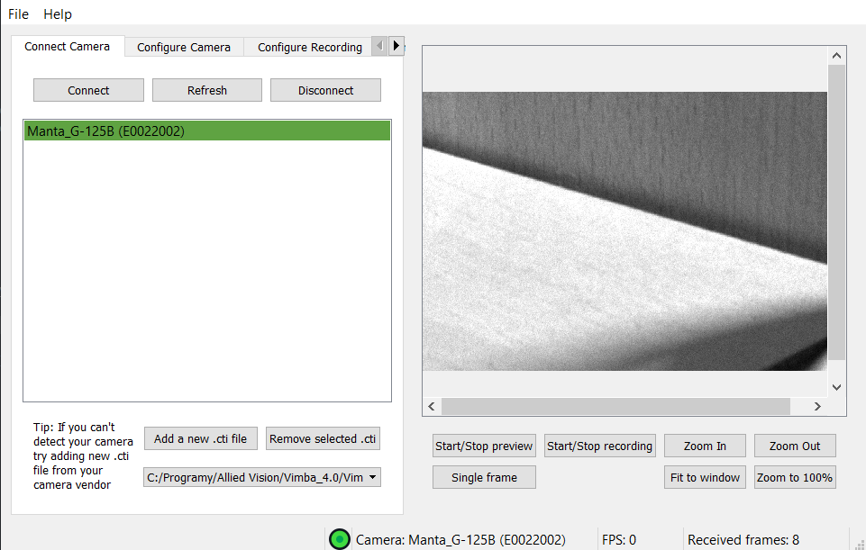

## What is Anubis?
Anubis is an application created as a part of a bachelor thesis. The application allows user to connect GenICam compliant devices from various vendors without need to use multiple applications. The cameras can be used to acquire images and save them to the hard drive. Cameras can also be configured using GenICam nodes. The application also implements a Tensorflow library which allows user to load up their ANN models and use them for training as well as for classification.

## How to run
To run this application you need to install all the dependencies specified in the requirements.txt file. If using pip run command 'pip install -r requirements.txt' in the root directory of the application. After you install the dependencies, you will need to install Vimba SDK and Vimba python. Download Vimba from [here](https://www.alliedvision.com/en/products/software.html). When the installation completes, leave the Install Vimba Drivers checked and exit the installer. After all remaining drivers finish intalling restar your computer.

Now you can navigate to your Vimba installation folder and in the directory Vimba_4.2/VimbaPython/Source run command 'pip install .' in case of problems refer to readme file in that folder. The application should now be set up and able to run.

When you have everything prepared you can run the anubis.py script or you can proceed to building the app for it to be executable without a need for a Python environment on the host computer.

## Building the app
The application is diustributed in a form of source files and can be run from any IDE or via console by running the anubis.py file. In case you want to create executable that is not dependent on any external libraries, you can follow this short tutorial. Please note that the application was tested mainly by running it inside of a python environment and the executable can contain some unforeseen bugs.

1. you will need to do these steps to make sure that the Tensorflow will be included correctly in the output file. 
	* Locate your environment folder and copy Lib/site-packages/tesnsorflow folder into the root directory of the application. If you cannot locate it, it may be named tensorflow_core. You can copy this one and rename it to tensorflow.
	* Open the new Tensorflow folder and navigate to lite/python/lite.py and comment out this line (line 37)
`from tensorflow.lite.experimental.microfrontend.python.ops import audio_microfrontend_op`

2. Make sure your computer has Vimba installed
3. Now go back to the root directory and open console with environment containing all dependencies and pyInstaller. 
4. Execute the followng command
`pyinstaller --noupx --onefile --hidden-import=tensorflow --hidden-import=tensorflow.lite.python.lite -F -–noconsole anubis.py`

5. After the building finishes, move everything in the dist  folder to the root folder
6. From your environment folder navigate to Library/bin and copy the following files to your application directory
	* mkl_core.1.dll
	* mkl_def.1.dll
	* mkl_intel_thread.1.dll
7. Now you can remove directories build, dist and tensorflow as well as anubis.spec file
8. The file can be now executed, but know that the pyInstaller built apps take a long time to start

This process will work on any PC but the output file is not universal because of Vimba installation path can change from PC to PC.

## Development
The application will most likely not be further developed, however if it is used in some classes, the bugs that will arise will be fixed. Whole application is written to be modular and as such anyone can develop it further and create forks of this project.

## Documentation
Documentation is written using Doxygen and can be generated using doxygen command inside the root directory. Doxygen will generate a html and a Latex versions of the documentation, use of the html version is strongly recommended. More information about the project, used tools etc. can be found in the bachelor thesis itself which is accessible in the czech language on this [link](https://www.vutbr.cz).
